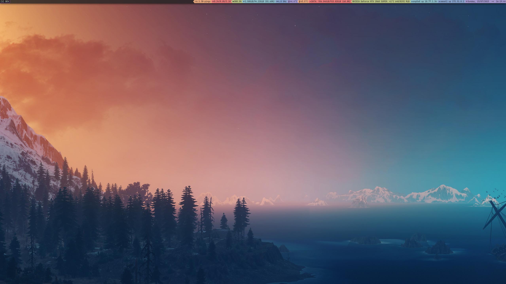
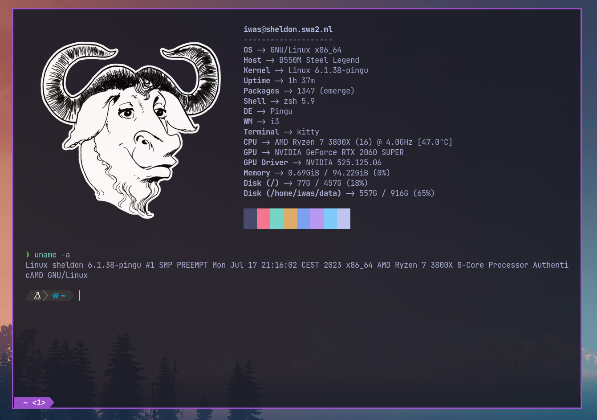
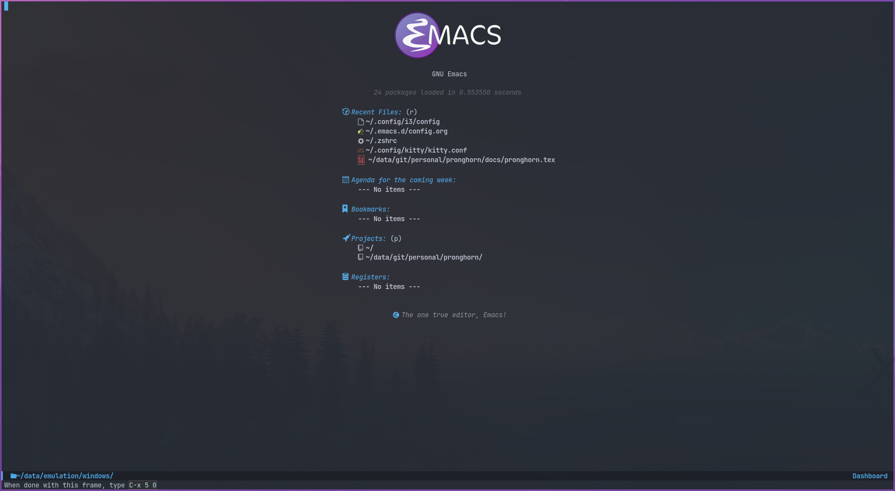
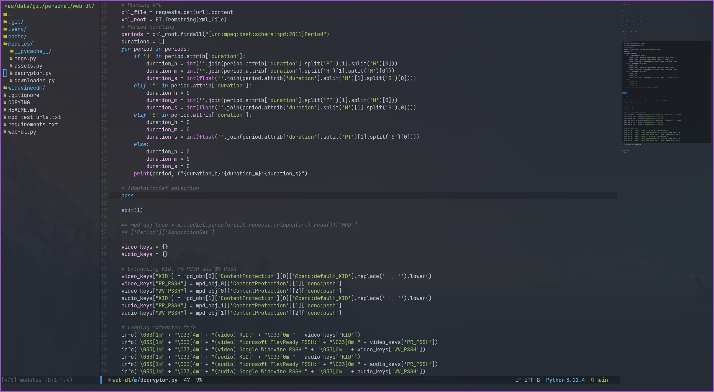

[//]: # (Title of the project)


# Pingu: DE & dotfiles

[//]: # (Repository badges)

[](https://www.gnu.org/licenses/gpl-3.0.html)

[//]: # (README Body)

Pingu is my personal `dotfiles` repository, which creates a Desktop Environment (DE) based on Gentoo's Portage package management tool, which manages packages from its source code; thus, building from source the entire GNU/Linux system.

The layout of this repository is based on a technique I've recently taken to calling it the **Git bare dotfiles organization strategy**, which is extensively explained and discussed both in this 2016 [Hacker News thread](https://news.ycombinator.com/item?id=11070797) by the user *StreakyCobra*, and in an [article published by Atlassian](https://www.atlassian.com/git/tutorials/dotfiles), in their Git tutorials section.

This technique, then, consists in creating a bare repository (the `.git` directory in a complete repo with its worktree there as well) in `$HOME/.pingu`, and defining the worktree as the `/` (root) of the entire filesystem. This is specified command-based, as such:
```shell
$  git --git-dir=$HOME/.pingu --work-tree=/
```
But, for the sake of convenience, this command is aliased to the `pingu` keyword, which can be used to issue commands to perform normal Git operations under the dotfiles repository, located in this case under `$HOME/.pingu`.

> This work and all its documentation is licensed under the Creative Commons Attribution-ShareAlike 4.0 International (CC BY-SA 4.0) License.\
> This program is free software: you can redistribute it and/or modify it under the terms of the GNU General Public License as published by the Free Software Foundation, either version 3 of the License, or (at your option) any later version.\
> This program is distributed in the hope that it will be useful, but WITHOUT ANY WARRANTY; without even the implied warranty of MERCHANTABILITY or FITNESS FOR A PARTICULAR PURPOSE. See the GNU General Public License for more details.

## Table of Contents

- [Install media](#install-media)
    - [Official Gentoo Minimal Installation ISO](#official-gentoo-minimal-installation-iso)
    - [Alternative GNU/Linux LiveCD ISO](#alternative-gnu-linux-livecd-iso)
- [Installation](#installation)
    - [Disks partitioning](#disks-partitioning)
    - [Stage-3 (Bootstrap) Base System](#stage-3-base-system)
    - [Building (Target) Base System](#building-target-base-system)
    - [Building Kernel](#building-kernel)
    - [Basic system configuration](#basic-system-configuration)
- [Pingu environment](#pingu-environment)
- [Main components](#main-components)
    - [i3](#i3)
    - [Kitty](#kitty)
    - [GNU Emacs](#gnu-emacs)
- [Kernel maintenance](#kernel-maintenance)
	- [New kernel version](#new-kernel-version)
		- [Install stage](#install-stage)
		- [Build stage](#build-stage)
	- [Reconfigure current kernel version](#reconfigure-current-kernel-version)

## Install media

(...)

### Official Gentoo Minimal Installation ISO

This is the URL pattern where the ISO lives (updated periodically): `https://distfiles.gentoo.org/releases/amd64/autobuilds/current-install-amd64-minimal/install-amd64-minimal-*.iso`, where `*` is the timestamp taken when that particular ISO was built.

Assume `$ISO` is the previous URL.

A `$ISO.DIGESTS` file is available, which provides a set of hashes to verify the integrity of the downloaded ISO. If only wanted a SHA256 hash, the file `$ISO.sha256` file can be downloaded instead.

Also, a `$ISO.asc` file is available, which contains the PGP signature of the downloaded ISO
. In order to verify the authenticity of the signature, one must do:

```shell
$  gpg --auto-key-locate=clear,nodefault,wkd --locate-key releng@gentoo.org
$  gpg --verify install-amd64-minimal-*.iso.asc
```

### Alternative GNU/Linux LiveCD ISO

(...)

## Installation

Installation guide of the GNU/Linux distribution offered by Gentoo.

(...)

### Disks partitioning

(...)

```shell
#  cfdisk /dev/$DISK1
```

(...)

| LABEL | MOUNTPOINT | PARTITION TYPE   | FORMAT | SIZE |
|-------|------------|------------------|--------|------|
| EFI   | /boot/EFI  | EFI System       | fat32  | 128M |
| BOOT  | /boot      | Linux filesystem | ext4   | 896M |
| SYS   | /          | Linux filesystem | ext4   | REST |

(...)

```shell
#  cfdisk /dev/$DISK2
```

(...)

| LABEL | MOUNTPOINT       | PARTITION TYPE   | FORMAT | SIZE |
|-------|------------------|------------------|--------|------|
| DATA  | $HOME/data       | Linux filesystem | ext4   | ALL  |

(...)

### Stage-3 Base System

(...)

### Building (Target) Base System

(...)

### Building Kernel

(...)

### Basic system configuration

(...)

## Pingu environment

(...)

```shell
$  git clone --bare https://github.com/iwas-coder/pingu $HOME/.pingu
```

(...)

```shell
#  git --git-dir=$HOME/.pingu --work-tree=/ checkout -f
```

(...)

## Main components

(...)

### i3



(...)

As an add-on, I use the `picom` compositor (a fork of the initial `compton` project) to add transparency, shadows and animations to all windows and apps. Specifically, I am using the [pijulius's fork](https://github.com/pijulius/picom), which includes ***fantastic animation code*** to the project (the only one I tried that works perfectly for production).

For this reason, I'd like to give a ***shoutout*** to *Istvan Petres* for this fork and all its contributions, thank you!

```shell
$  cd ~/data/git/external
$  git clone https://github.com/pijulius/picom picom.pijulius
$  cd !$
$  git submodule update --init --recursive
$  meson setup --buildtype=release . build
$  ninja -C build
#  ln -s $(pwd)/build/src/picom /usr/local/bin
```

If wanted to reduce file size of the binary, using the `upx` utility, do:
```shell
$  upx --color --best build/src/picom
```

### Kitty



(...)

### GNU Emacs




(...)

## Kernel maintenance

(...)

### New kernel version

(...)

#### Install stage

(...)

#### Build stage

Check current `/usr/src/linux` symlink:
```shell
$  eselect kernel list
```

Change the symlink to the new version by doing:
```shell
#  eselect kernel set <N>
```

Ensure the source tree is properly cleaned up:
```shell
#  make mrproper
```

Copy the previous kernel configuration file to the source tree:
```shell
#  cp -v /boot/config-<VERSION> .config
```

Adapt the previous configuration to the new version, and open up the kernel `.config` file with the `menuconfig` editor:
```shell
#  make menuconfig
```

Pass the unit test suite (pytest) to check for config errors:
```shell
#  make testconfig
```

Build the kernel (`vmlinux`), its selected modules (`*.ko`) and the kernel compressed image (`bzImage`).
```shell
#  KCFLAGS="-march=<ARCH> -O2 -pipe" nice make [-j<N>]
```
Add the `-j<N>` flag so that GNU Make can parallelize jobs, where `N` is the number of jobs to handle in parallel.

Replace `<ARCH>` with the CPU's architecture name that GNU GCC handles (e.g. `znver2` for Zen2; `znver3` for Zen3). This can be searched online, or guessed by GCC itself doing:
```shell
$  gcc -Q -march=native --help=target | grep march | head -n 1
```

Install the built modules into `/lib/modules/<VERSION>`:
```shell
#  make modules_install
```

Export the API headers into `./usr`, in case needed later on:
```shell
#  make headers
```

Install the kernel's needed resources in `/boot`, using the following mapping:
- `bzImage` -> `/boot/vmlinuz-<VERSION>`
- `System.map` -> `/boot/System.map-<VERSION>`
- `.config` -> `/boot/config-<VERSION>`
If these files already existed in `/boot` prior to this step, then it renames them to `*.old`, in order to maintain a backup until the new version gets tested.
```shell
#  make install
```

Create the first iteration of the initial ramdisk FS (i.e. `initramfs` or `initrd`):
```shell
#  dracut --kver=<VERSION> --hostonly --early-microcode
```

Once booted to the newly built kernel, create the second and last iteration of the initrd image (same command as the previous one).

### Reconfigure current kernel version

Open up `/usr/src/linux` directory (where the current installed kernel source tree lives) and open the kernel `.config` file with the `menuconfig` editor:

```shell
#  make menuconfig
```

Pass the unit test suite (pytest) to check for config errors:
```shell
#  make testconfig
```

(...)

Make a backup of the current initramfs file (`/boot/initramfs-<VERSION>.img`):
```shell
#  cp -v /boot/initramfs-<VERSION>.img /boot/initramfs-<VERSION>.img.old
```

Create the first iteration of the initial ramdisk FS (i.e. `initramfs` or `initrd`):
```shell
#  dracut --kver=<VERSION> --hostonly --early-microcode --force
```
The argument `--force` needs to be specified as it already exists an initramfs file (`/boot/initramfs-<VERSION>.img`).

(...)
